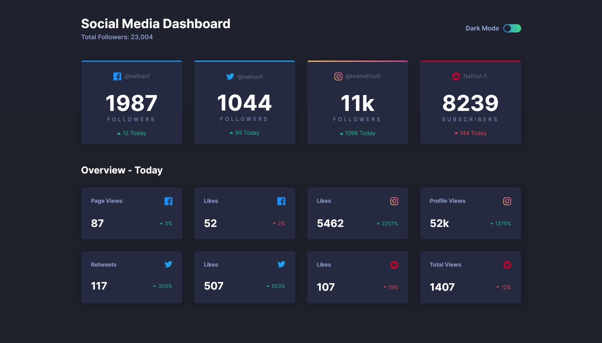

# Frontend Mentor - Social media dashboard with theme switcher solution

This is a solution to the [Social media dashboard with theme switcher challenge on Frontend Mentor](https://www.frontendmentor.io/challenges/social-media-dashboard-with-theme-switcher-6oY8ozp_H).

## Table of contents

- [Overview](#overview)
  - [The challenge](#the-challenge)
  - [Screenshot](#screenshot)
  - [Links](#links)
- [My process](#my-process)
  - [Built with](#built-with)
  - [What I learned](#what-i-learned)
- [Author](#author)

## Overview

### The challenge

Users should be able to:

- View the optimal layout for the site depending on their device's screen size
- See hover states for all interactive elements on the page
- Toggle color theme to their preference

### Screenshot




### Links

- Solution URL: [Click Here](https://github.com/Ahmed1shihab/social-media-dashboard)
- Live Site URL: [Click Here](https://ahmed1shihab.github.io/social-media-dashboard/)

## My process

### Built with

- Semantic HTML5 markup
- CSS custom properties
- Flexbox
- CSS Grid
- Javascript
- Mobile-first workflow

### What I learned

I learned how o to create an **ON/OF Switcher** and how to **set theme based on user system prefers** theme using JavaScript also **save theme to localstorge** using JavaScript

```html
<div class="theme-switcher">
  <p>Dark Mode</p>
  <label for="checkbox">
    <input type="checkbox" name="dark-theme" id="checkbox" />
    <span class="ball"></span>
  </label>
</div>
```
```js
// Set Theme Based on User System Prefers Theme
const prefersDarkScheme = window.matchMedia("(prefers-color-scheme: dark)");
if (prefersDarkScheme.matches) {
  document.body.classList.remove("light-theme");
  document.body.classList.add("dark-theme");
} else {
  document.body.classList.remove("dark-theme");
}
```

## Author

- GitHub - [@Ahmed1shihab](https://www.github.com/Ahmed1shihab)
- Frontend Mentor - [@Ahmed1shihab](https://www.frontendmentor.io/profile/Ahmed1shihab)
- Instagram - [@7nv__](https://www.instagram.com/7nv__)
